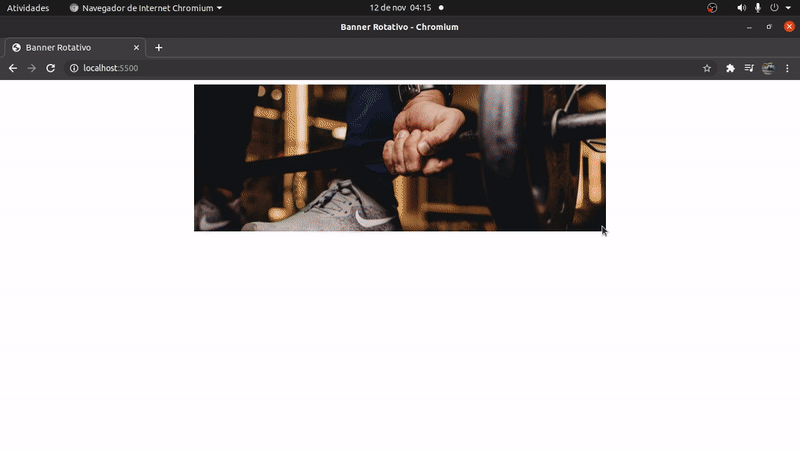

<h1 align="center">
    
</h1>

## 🏷️ Sobre 
Uma ideia de transição de banners para aplicar de diversas formas.

---

## 🛠️ Tecnologias utilizadas
Foram utilizadas as seguintes tecnologias para desenvolver o **Banner Rotativo** :

- HTML
- CSS
- JavaScript

---

## Autor
### 👤 Elisio Wander

- Twitter: [@elisioWander](https://twitter.com/Elisio741)
- Linkedin: [@elisioWander](https://www.linkedin.com/in/elisio-wander-b88b69136/)
- github: [@elisioWander](https://github.com/ElisioWander)

---

### Desenvolvido 💜 by Elisio Wander
